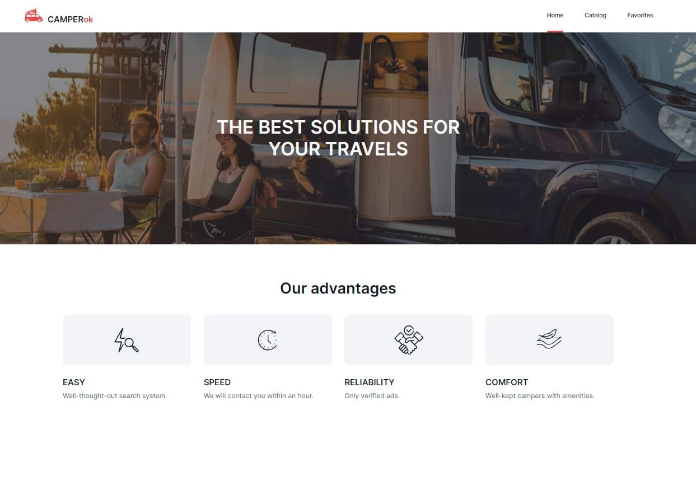
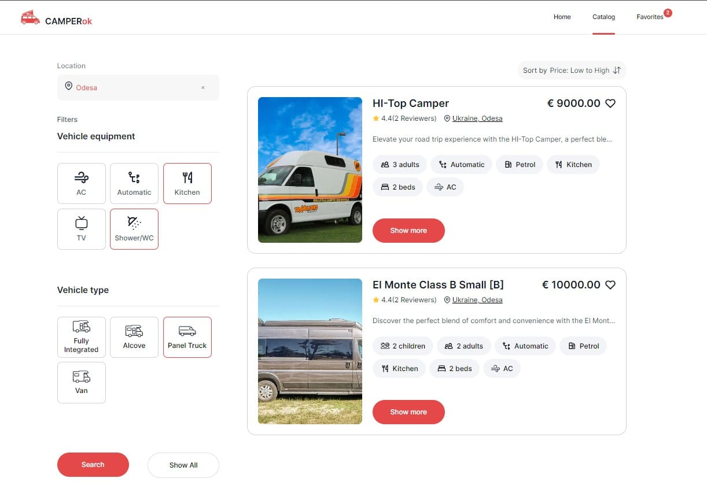
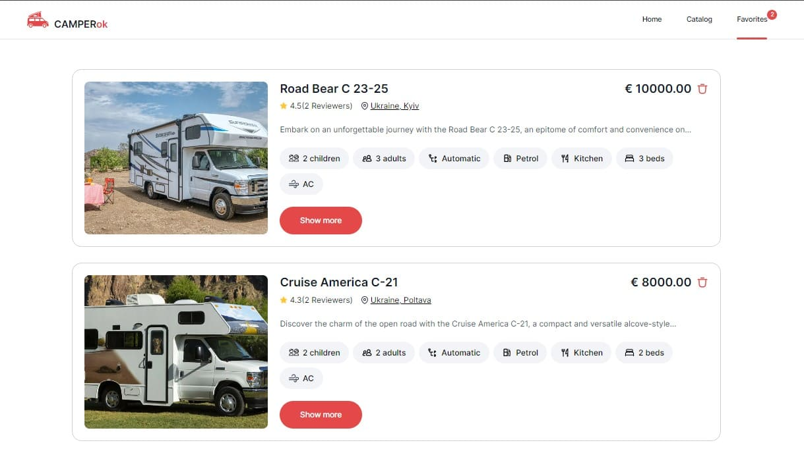

# CAMPERok  

A convenient web application for finding campers for a perfect vacation. 
It consists of three pages: Home, Catalog, Favorites. It has a simple and intuitive interface.

[Figma](https://www.figma.com/design/fnMWH0eBB7NnoqdAiiKWsQ/Test?node-id=0-1&t=Z3FM04tPACbF9l6D-0)

## Features

+ Advertisement with detailed information about the camper, photo gallery and reviews.
+ Search by city.
+ Filter by equipment and car type.
+ Sort by price and rating.
+ A convenient form for booking the selected camper.
+ Ability to add ads to favorites.

## Technologies and Libraries Used

___

